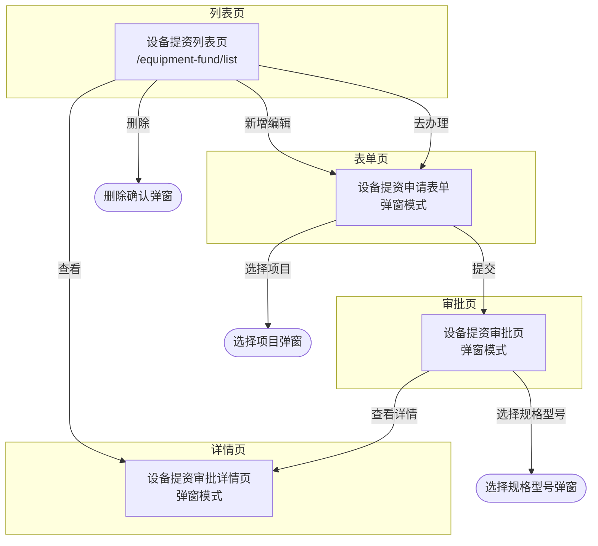

# 输出模板规范（v2）

> 本文件供 Generator-Module SubAgent 使用，包含模块级输出的模板格式。

---

## 1. 页面详情文档结构

每个页面生成独立文件 `page-{pageId}.md`：

```markdown
# {pageName}

> 返回：[主文档索引](./index.md#页面索引) | PRD 源章节：[章节名]({prdPath}#{prdAnchor})

## 页面概览

| 项 | 值 |
|---|---|
| 页面类型 | {pageType} |
| 路由 | {route} |
| 菜单路径 | {menuPath} |
| PRD 章节 | [章节名]({prdPath}#{prdAnchor}) |
| 设计图位置 | [设计图]({designPath}#{designLocation}) |

## 模块导航

> 本页模块快速跳转：

| 模块 | 名称 | 快速跳转 |
|------|------|---------|
| M1 | {moduleName1} | [→ M1：{moduleName1}](#模块-m1-{moduleName1-kebab}) |
| M2 | {moduleName2} | [→ M2：{moduleName2}](#模块-m2-{moduleName2-kebab}) |
| ... | ... | ... |

## 页面关系图

> 本页面与其他页面的跳转关系（完整关系图见 [主文档索引](./index.md#页面关系图)）：

```mermaid
flowchart LR
    {currentPageId}["{currentPageName}<br/>{route}"]

    {currentPageId} -->|{action1}| {targetPageId1}["{targetPageName1}"]
    {currentPageId} -->|{action2}| {targetPageId2}["{targetPageName2}"]

    {currentPageId} -.->|{modalAction}| {modalId}(["{modalName}"])
```

**跳转关系说明**：

| 按钮/操作 | 目标页面 | 目标类型 | 文档链接 |
|----------|---------|---------|---------|
| {action1} | {targetPageName1} | {pageType} | [{targetPageName1}](./page-{targetPageId1}.md) |
| {action2} | {targetPageName2} | {pageType} | [{targetPageName2}](./page-{targetPageId2}.md) |
| {modalAction} | {modalName} | 弹窗 | [{modalName}](./modal-{modalId}.md) |

> **⚠️ Mermaid 语法规范**：箭头标签 `|xxx|` 中禁止使用双引号，节点名称使用双引号，圆角矩形用双括号 `(["xxx"])`。

## 模块{moduleId}：{moduleName}

> PRD：[PRD 章节]({prdPath}#{prdAnchor}) | 设计图来源：`{designFileName}`

### 设计图结构（完整内容）

> **说明**：以下内容来自设计图文档（{designFormat} 格式），完整嵌入以便快速查阅，无需跳转。

```{codeBlockLang}
# {moduleName} - 设计图完整内容
# 来源文件：{designFileName}
# 对应行号：L{startLine}-L{endLine}

{designSnippet}
```

### 字段清单

| 字段名 (API) | 中文名 | 组件 | 必填 | 只读 | 精度/格式 | PRD 说明 |
|-------------|-------|------|------|------|----------|---------|
| {apiFieldName} | {label} | {component} | {required} | {readonly} | {precision} | [PRD]({prdPath}#{anchor})：{description} |

### 按钮清单

| 按钮名 | 功能 | 显示条件 | 点击行为 | PRD 说明 |
|-------|------|---------|---------|---------|
| {name} | {function} | {condition} | {action} | [PRD]({prdPath}#{anchor})：{description} |

---

## 页面级逻辑

### 初始化逻辑
{initLogic}

### 交互逻辑
{interactionLogic}

### 分页配置（列表页）
- 默认 pageSize：20
- pageSize 选项：[20, 50, 100]

### 数据权限（列表页）
{dataPermission}

---

## 弹窗引用

| 弹窗名称 | 触发按钮 | 文档链接 |
|----------|---------|---------|
| {modalName} | {triggerButton} | [{modalName}](./modal-{modalId}.md) |

---

## 特别强调

{highlights}
```

---

## 2. 弹窗详情文档结构

每个弹窗生成独立文件 `modal-{modalId}.md`：

```markdown
# {modalName}

> 返回：[主文档索引](./index.md#弹窗索引) | 来源页面：[pageName](./page-{pageId}.md)

## 弹窗概览

| 项 | 值 |
|---|---|
| 弹窗标识 | {modalId} |
| 弹窗标题 | {modalName} |
| 弹窗类型 | {modalType} |
| PRD 章节 | [章节名]({prdPath}#{prdAnchor}) |
| 设计图位置 | [设计图]({designPath}#{designLocation}) |

## 来源描述

| 来源页面 | 来源按钮 | 传入参数 | 返回值 |
|----------|---------|----------|--------|
| {sourcePage} | {sourceButton} | {params} | {returnValue} |

## 弹窗内容

### 字段清单

| 字段名 | 中文名 | 类型 | 说明 |
|--------|-------|------|------|
| {field} | {label} | {type} | {desc} |

### 按钮清单

| 按钮名 | 功能 | 点击行为 | 校验 |
|-------|------|---------|------|
| {name} | {func} | {action} | {validate} |

## 页面逻辑

- 初始化：{initLogic}
- 选择逻辑：{selectLogic}
- 数据过滤：{filterLogic}

## API 导图（如有）

| 接口 | 调用时机 | 说明 |
|-----|---------|------|
| {api} | {timing} | {desc} |

## 特别强调

{highlights}
```

---

## 3. 主索引文件结构

`index.md` 结构：

```markdown
# {moduleName} - 前端开发指南

> 版本：{version} | PRD：[查看]({prdPath}) | 设计图：[查看]({designPath}) | 生成时间：{currentTime}

---

## 项目目录结构

> 遵循 `.claude/rules/global/directory-structure.md` 规范，标准参考：`eng-manage` 模块

```
src/views/{moduleKebab}/
├── hooks/                            # 模块级共享 hook
├── components/                       # 模块级共享组件
└── {pageKebab}/                      # {业务中文名}（本模块）
    ├── index.tsx                     # {listPageType}入口（路由入口）
    ├── useIndex.tsx                  # {listPageType}逻辑（registerTable + 搜索 + 操作回调）
    ├── style.module.less             # 样式
    ├── api/
    │   ├── index.ts                  # API 接口函数
    │   ├── types.ts                  # 类型定义（入参/出参/枚举）
    │   └── config.ts                 # 业务枚举常量（审批状态、业态等）
    ├── hooks/                        # 页面级 hook（可选）
    └── components/
        ├── {FormComponent}/          # {表单中文名}（弹窗）
        │   ├── index.tsx             # 表单渲染
        │   ├── useForm.ts            # 表单逻辑
        │   └── style.module.less
        ├── {DetailComponent}/        # {详情中文名}
        │   ├── index.tsx
        │   ├── useDetail.ts
        │   └── style.module.less
        ├── {SectionComponent}/       # {区块中文名} Section
        │   ├── index.tsx
        │   └── style.module.less
        └── {SelectModalComponent}/   # {选择弹窗中文名}
            ├── index.tsx
            ├── use{SelectModal}.ts
            └── style.module.less
```

### 审批页目录

审批页不在业务模块内，位于 `office` 目录：

```
src/views/office/todo/components/apply-modal/
├── {businessKebab}.tsx               # {moduleName}审批组件（引用业务模块 DetailModal）
└── approval-form/
    └── {ApprovalFormComponent}.tsx   # 审批专用表单

src/views/office/todo/components/
└── register.tsx                      # 注册 procDef.key → 组件映射
```

### 路由配置

| 路由 | 页面 | 对应文件 |
|------|------|---------|
| {route} | {pageName} | `{moduleKebab}/{pageKebab}/index.tsx` |

> 弹窗页面（{modalPageNames}）无独立路由，由列表页或审批页内部控制显示/隐藏。

---

## 页面关系图

```mermaid
flowchart TD
    ...（见第 10 节模板）
```

---

## 快速导航

### 按页面类型导航

| 页面类型 | 页面名称 | 路由 | 文档链接 |
|----------|----------|------|----------|
| {pageTypeCN} | {pageName} | {route 或 "-"} | [详情](./page-{pageId}.md) |

### 页面索引
| 序号 | 页面名称 | 页面类型 | 路由 | 文档链接 | PRD 章节 |
|------|----------|----------|------|----------|---------|
| 1 | {pageName} | {pageType} | {route} | [详情](./page-{pageId}.md) | [章节名]({prdPath}#{prdAnchor}) |

### 弹窗索引
| 序号 | 弹窗名称 | 触发页面 | 文档链接 |
|------|----------|----------|----------|
| 1 | {modalName} | {triggerPage} | [详情](./modal-{modalId}.md) |

### 独立章节
| 章节 | 文档链接 |
|------|----------|
| 字典速查表 | [1-dict-nav.md](./1-dict-nav.md) |
| 审批流专题 | [2-approval-flow.md](./2-approval-flow.md) |
| 信息缝隙清单 | [9-gap-analysis.md](./9-gap-analysis.md) |

---

## 字典速查表（摘要）

| 字典编码 | 字典名称 | 字典项 | 完整文档 |
|----------|----------|--------|----------|
| {dictCode} | {dictName} | {items} | [1-dict-nav.md](./1-dict-nav.md#字典速查表) |

---

## 审批流专题（摘要）

> 完整内容见：[2-approval-flow.md](./2-approval-flow.md)

```mindword
{approvalFlowSummary}
```

---

## 信息缝隙清单（摘要）

| 页面 | 模块 | 字段/按钮 | 缺失来源 | 说明 |
|------|------|----------|---------|------|
| {page} | {module} | {field} | {source} | {desc} |

完整清单见：[9-gap-analysis.md](./9-gap-analysis.md)

---

## 业务流程说明

{businessBackground}

业务校验规则（提交申请时）：
1. {validationRule1}
2. {validationRule2}
...

如未通过校验，只能暂存申请，提示："{failMessage}"
```

**项目目录结构生成规则**：
- `moduleKebab`：从设计图路径推断业务域目录名，无法推断时用 `moduleName` 转 kebab-case
- `pageKebab`：从列表页 `pageName` 提取核心业务名词，转 kebab-case（如"设备提资列表页" → "design-input"）
- 组件名生成（PascalCase）：
  - 表单页 → `{核心名词}Form`（如 `EquipmentFundForm`）
  - 详情弹窗 → `{核心名词}DetailModal`（如 `EquipmentFundDetailModal`）
  - Section → `{区块名}Section`（如 `BasicInfoSection`）
  - 选择弹窗 → `Select{名词}Modal`（如 `SelectProjectModal`）
- Section 组件从 scannerIndex 的模块中提取（moduleType = form/display 的模块各生成一个 Section）
- 参照 `directory-structure.md` 四种页面类型的标准文件结构
- 路由配置表仅列出有独立路由的页面

**按页面类型导航生成规则**：
- 遍历 `scannerIndex.pages[]`，按 `pageType` 排序：列表页 > 表单页 > 审批页 > 详情页 > 其他
- `pageType` 转中文：list→列表页, form→表单页, approval→审批页, detail→详情页
- 无路由的页面显示 `-`

**业务流程说明生成规则**：
- 从 `enhancedIndex.businessRules.background` 提取业务背景描述（1-3句话）
- 从 `enhancedIndex.businessRules.validationRules` 提取校验规则，格式化为编号列表
- 从 `enhancedIndex.businessRules.failMessages` 提取校验失败提示文案，用引号包裹
- 如 `enhancedIndex` 中无 `businessRules` 数据，不生成此章节

---

## 4. 字段清单表格格式

### 普通页面（列表页/表单页/详情页）

7 列简化格式：

| 字段名 (API) | 中文名 | 组件 | 必填 | 只读 | 精度/格式 | PRD 说明 |
|-------------|-------|------|------|------|----------|---------|
| applyNo | 申请单号 | Input | N | N | 文本，最大 64 字符 | [PRD](#)：支持模糊搜索 |

### 审批页

8 列格式（增加"可编辑节点"列）：

| 字段名 (API) | 中文名 | 组件 | 必填 | 可编辑节点 | 精度/格式 | PRD 说明 |
|-------------|-------|------|------|----------|----------|---------|
| designCapacity | 设计容量 | InputNumber | Y | 技术部填写节点 | ≤500，MW/MWp | [PRD](#)：按业态动态单位 |

---

## 5. 信息缝隙清单格式

`9-gap-analysis.md` 结构：

```markdown
# {moduleName} - 信息缝隙清单

> 返回：[主文档索引](./index.md)

> **说明**：本清单列出 PRD 和设计图中未明确或矛盾的信息，开发前需与产品确认。

---

## PRD 未明确字段

| 页面 | 模块 | 字段名 | 中文名 | 说明 |
|------|------|--------|--------|------|
| {page} | {module} | {fieldName} | {label} | PRD 中未找到对应描述 |

## API 未定义字段

| 页面 | 模块 | 字段名 | 中文名 | 原因 |
|------|------|--------|--------|------|
| {page} | {module} | {fieldName} | {label} | {reason} |

## PRD 矛盾项

| 页面 | 模块 | 字段名 | 矛盾描述 | 暂定结论 |
|------|------|--------|---------|---------|
| {page} | {module} | {fieldName} | 在{章节 A}描述为{值 A}，在{章节 B}描述为{值 B} | 暂以{章节 X}为准 |

## 设计图与 PRD 不一致

| 页面 | 模块 | 类型 | 设计图描述 | PRD 描述 | 处理建议 |
|------|------|------|-----------|---------|---------|
| {page} | {module} | {type} | {designDesc} | {prdDesc} | {suggestion} |
```

---

## 6. 特别强调 Checklist

生成「特别强调」章节时，必须逐项检查：

### 字段类

- [ ] 字段名称随业态/场景动态变化
- [ ] 字段在某种业态/场景下完全不显示
- [ ] 字段外观为自动判定/只读，但实际允许手动修改
- [ ] 字段支持自动带出，且带出逻辑有多个分支条件
- [ ] 字段精度要求与通用规范不一致
- [ ] 同一字段在不同场景下必填条件不同

### 业务逻辑类

- [ ] 存在影响审批流走向的关键字段，且该字段允许人工干预
- [ ] 审批通过后有数据回写，且不同申请类型取值来源不同
- [ ] 驳回后重新编辑时，有字段自动刷新逻辑
- [ ] 列表同一状态下有多种情况，按钮集合不同

### 按钮类

- [ ] 按钮名称与常规命名不同，需特别注意原文
- [ ] 删除操作有特殊语义
- [ ] 按钮位置特殊（如"冻结在页面底部"）

### 权限类

- [ ] 某字段仅在特定审批节点可编辑，其他节点只读
- [ ] 某按钮仅在特定节点的特定区域有效

### PRD 矛盾

- [ ] 发现值集、只读性、按钮名称等前后矛盾

### 三源冲突

- [ ] 设计图字段名与 API 字段名不一致（以 API 为准，标注差异）
- [ ] 设计图枚举值与 API 枚举值不一致（以 API 为准，标注差异）
- [ ] PRD 必填性与设计图/API 不一致（以 PRD 为准）

### 下拉数据源缺失

- [ ] Select 组件字段无对应的字典编码或数据源接口（保留位置并标注 `[待确认]`）
- [ ] 联动字段（如分公司→区域）的数据源和联动规则未说明

**如果没有命中任何项，写：经检查无特殊风险点。**

---

## 7. PRD 链接格式

所有 PRD 引用使用以下格式：

```markdown
[PRD]({prdPath}#{anchor})：{description}
```

示例：
```markdown
[PRD](./prd.md#5152-开工申请列表 - 查询条件)：支持模糊搜索，最大长度 64 字符
```

---

## 8. 设计图链接格式（格式感知）

所有设计图引用使用以下格式：

```markdown
[设计图]({designFileName}#L{start}-L{end})
```

示例：
```markdown
[设计图](设备提资申请表单页.yaml#L44-L201)
[设计图](01-list.html#L20-L42)
```

**设计图片段引用**（嵌入模块章节，格式感知）：

根据 `designFormat` 决定代码块语言：

| designFormat | 代码块语言 | 示例 |
|-------------|-----------|------|
| HTML | `html` | ````html\n<!-- 搜索筛选区 -->\n<div class="search-area">...` |
| YAML | `yaml` | ````yaml\nsections:\n  - name: "basicInfo"...` |
| ASCII | `text` | ````text\n┌──────────────────────┐...` |
| Markdown | `text` | ````text\n## 模块：筛选查询区\n| 字段名 | 组件类型 |...` |

**模板变量**：
- `{designSnippet}`：通用内容片段（替代原 `{designYamlContent}`）
- `{designFormat}`：设计图格式
- `{codeBlockLang}`：映射后的代码块语言

---

## 9. API 接口概览模板（新增）

每个页面生成接口概览章节，放在「页面概览」之后：

```markdown
## 涉及的接口

### 业务接口

| 接口 | 方法 | 路径 | 功能 | 调用时机 |
|------|------|------|------|---------|
| `getEquipmentSubmissionDetail` | GET | /api/pm-design/equipmentSubmission/detail/{id} | 获取设备提资详情 | 申请表单编辑时加载数据 |
| `addEquipmentSubmission` | POST | /api/pm-design/equipmentSubmission/add | 新增设备提资 | 申请表单暂存/提交 |

**`接口名` 响应字段**（仅列表页/详情页）：

| 字段名 | 类型 | 说明 |
|--------|------|------|
| id | string | 提资 ID |
| submissionNo | string | 提资单号 |
| projectId | string | 项目 ID |

**`接口名` 请求参数**（仅表单页/审批页）：

| 参数名 | 类型 | 必填 | 说明 |
|--------|------|------|------|
| projectId | string | 是 | 项目 ID |
| tradingOwner | string | 否 | 交易业主 |

### 辅助接口（下拉数据源）

> 以下接口为 Select 组件提供下拉选项数据，不直接参与业务操作。

| 接口 | 方法 | 路径 | 功能 | 适用字段 |
|------|------|------|------|---------|
| `{接口名}` | {方法} | {路径} | {功能说明} | {字段名} |

**`findOrgIncludeSub` 用法示例**（组织架构接口）：

| 用途 | 参数 | 说明 |
|------|------|------|
| 获取分公司列表 | `{ type: 1, codes: [] }` | codes 传空数组 |
| 获取区域列表 | `{ type: 2, codes: ['分公司code'] }` | 传入分公司 code，联动获取 |

> **分公司联动规则**：选择分公司后，自动加载该分公司下的区域选项；切换分公司时，清空已选区域。

> **说明**：如果生成时未找到某个 Select 字段的数据源接口，在此处标注 `[待确认：{字段名} 的下拉数据源接口未明确]`。
```

**辅助接口生成规则**：

1. 扫描页面中所有 Select 组件字段
2. 对每个 Select 字段，检查其数据来源：
   - 字典类（审批状态、业态等）→ 记录字典编码
   - 组织类（分公司、区域等）→ 记录组织架构接口信息
   - 无数据源 → 在辅助接口表中保留一行，标注 `[待确认：{字段名} 的下拉数据源接口未明确]`
3. 联动字段（如分公司→区域）需说明联动规则

**API 接口概览放在 index.md 中的结构**：

```markdown
## API 接口概览

### 列表查询 API

| 接口 | 方法 | 路径 | 功能 | 调用时机 |
|------|------|------|------|---------|
| `getEquipmentSubmissionList` | GET | /api/pm-design/equipmentSubmission/list | 分页查询设备提资列表 | 列表页初始化、搜索、分页 |

**`getEquipmentSubmissionList` 详细参数**

请求参数 (`EquipmentSubmissionSearchParams`)：

| 参数名 | 类型 | 必填 | 说明 | 示例 |
|--------|------|------|------|------|
| pageNum | number | 是 | 页码 | 1 |
| pageSize | number | 是 | 每页条数 | 10 |
| projectName | string | 否 | 项目名称（模糊查询） | "测试项目" |

响应数据：
```typescript
{
  records: EquipmentSubmissionRecord[];  // 记录列表
  total: number;                          // 总记录数
}
```

---

### 详情查询 API

| 接口 | 方法 | 路径 | 功能 | 调用时机 |
|------|------|------|------|---------|
| `getEquipmentSubmissionDetail` | GET | /api/pm-design/equipmentSubmission/detail/{id} | 获取设备提资详情 | 编辑/审批/详情页初始化 |

**`getEquipmentSubmissionDetail` 详细参数**

响应数据 (`EquipmentSubmissionDetail`)：
```typescript
{
  id: string;                    // 提资 ID
  submissionNo: string;           // 提资单号
  projectId: string;              // 项目 ID
  // ... 更多字段
}
```

---

### 数据操作 API

| 接口 | 方法 | 路径 | 功能 | 调用时机 |
|------|------|------|------|---------|
| `addEquipmentSubmission` | POST | /api/pm-design/equipmentSubmission/add | 新增设备提资 | 申请表单暂存 |
| `updateEquipmentSubmission` | POST | /api/pm-design/equipmentSubmission/update | 编辑设备提资 | 申请表单编辑 |
| `submitEquipmentSubmission` | POST | /api/pm-design/equipmentSubmission/submit | 提交设备提资 | 申请表单提交 |
| `deleteEquipmentSubmission` | DELETE | /api/pm-design/equipmentSubmission/delete | 删除设备提资 | 列表页删除草稿 |

---

### 设备明细操作 API

| 接口 | 方法 | 路径 | 功能 | 调用时机 |
|------|------|------|------|---------|
| `addEquipmentDetail` | POST | /api/pm-design/equipmentSubmission/detail/add | 新增设备明细 | 审批页新增行 |
| `updateEquipmentDetail` | POST | /api/pm-design/equipmentSubmission/detail/update | 编辑设备明细 | 审批页编辑行 |
| `deleteEquipmentDetail` | DELETE | /api/pm-design/equipmentSubmission/detail/delete | 删除设备明细 | 审批页删除行 |

---

### 审批回调 API

| 接口 | 方法 | 路径 | 功能 | 调用时机 |
|------|------|------|------|---------|
| `equipmentSubmissionBpmCallback` | POST | /api/pm-design/equipmentSubmission/bpmCallback | 审批回调 | 审批页同意/驳回/抄送 |
```

---

## 10. 页面关系图模板（新增）

在 index.md 开头生成页面关系图：

```markdown
## 页面关系图


```

**页面关系提取规则**：
- 列表页 → 表单页：`新增`、`编辑`、`去办理` 按钮
- 列表页 → 详情页：`查看` 按钮
- 表单页 → 审批页：`提交` 按钮
- 审批页 → 详情页：`查看详情` 按钮
- 页面 → 弹窗：弹窗的 `triggerPage` 和 `triggerButton`

**⚠️ Mermaid 语法规范（重要）**：

1. **箭头标签禁止使用双引号**：
   - ❌ 错误：`A -->|点击"详情"| B`（标签中的双引号会与节点的双引号冲突,导致解析错误）
   - ✅ 正确：`A -->|点击详情| B`（直接写文字,不加引号）
   - ✅ 正确：`A -->|点击'详情'| B`（如必须加引号,使用单引号）

2. **节点定义使用双引号**：
   - ✅ 正确：`A["节点名称<br/>换行内容"]`
   - ✅ 正确：`B(["弹窗节点"])`（圆角矩形用双括号）

3. **常见解析错误原因**：
   - 箭头标签 `|xxx|` 中包含双引号 `"` → 去掉或改用单引号 `'`
   - 节点名称中使用了未转义的特殊字符 → 使用 `<br/>` 换行,避免使用 `/` `\` 等

4. **样式类定义**（可选）：
   ```mermaid
   classDef listPage fill:#e1f5fe,stroke:#01579b,stroke-width:2px
   class A listPage
   ```
