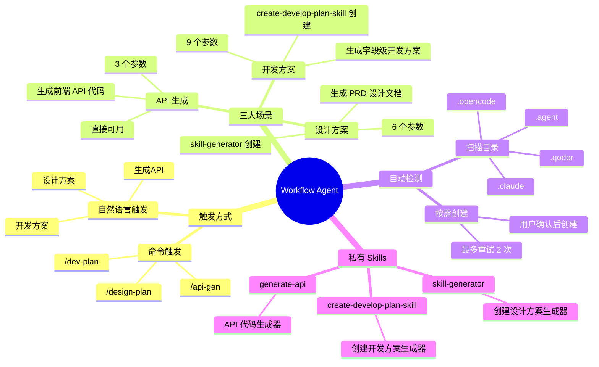
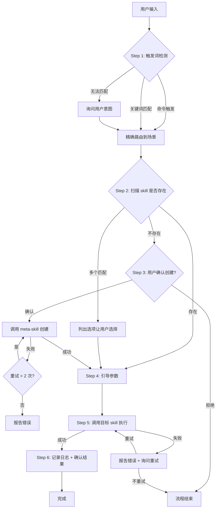

# Workflow Agent 使用指南

> 智能路由到设计方案、开发方案、API 生成三大场景，自动检测 skill 存在性，按需创建后引导执行。

## 目录

- [全局思维导图](#全局思维导图)
- [快速上手](#快速上手)
- [三大场景详解](#三大场景详解)
- [私有 Skills 详解](#私有-skills-详解)
- [执行流程](#执行流程)
- [参数速查](#参数速查)
- [示例流程](#示例流程)
- [目录结构](#目录结构)
- [常见问题](#常见问题)

---

## 全局思维导图



---

## 快速上手

### 一句话理解

workflow-agent 是一个**智能路由器**。你只需要说出你想做什么，它会自动判断该走哪个流程、检查依赖是否存在、引导你提供参数、然后执行对应的 skill。

### 最简用法

```
# 方式一：命令触发
/design-plan
/dev-plan
/api-gen

# 方式二：自然语言
"帮我创建设计方案"
"生成一个字段级开发方案"
"根据 Apifox 生成 API 代码"
```

### 第一次使用

如果你是第一次使用某个场景，workflow-agent 会：

1. 检测对应的 skill 是否存在
2. 不存在的话询问你是否创建
3. 你确认后会自动创建
4. 然后引导你填写必要参数
5. 最后执行并记录日志

整个过程只需要你回答几个问题，其余全自动处理。

---

## 三大场景详解

### 1. 设计方案

**用途**：根据 PRD 文档和设计图，自动生成结构化的前端设计方案文档。

**触发条件**：

| 触发方式 | 触发词 |
|---------|--------|
| 命令 | `/design-plan` |
| 关键词 | 设计方案、设计文档、设计指南、PRD生成、生成设计 |
| 模糊匹配 | "帮我用设计方案 skill 生成文档" |

**产出**：模块级设计方案文档，包含字段定义、组件映射、页面关系图、缝隙检测报告。

**依赖 skill**：`generate-{project}-guide`（由 skill-generator 创建）

### 2. 开发方案

**用途**：根据设计方案文档，生成字段级开发方案，指导前端开发。

**触发条件**：

| 触发方式 | 触发词 |
|---------|--------|
| 命令 | `/dev-plan` |
| 关键词 | 开发方案、开发文档、开发指南、字段级开发、生成开发方案 |
| 模糊匹配 | "帮我创建一个开发方案" |

**产出**：按页面类型和模块划分的开发方案文档，包含字段表、组件选型、参考代码。

**依赖 skill**：`generator-dev-plan`（由 create-develop-plan-skill 创建）

### 3. API 生成

**用途**：根据接口文档，自动生成前端 API 封装代码。

**触发条件**：

| 触发方式 | 触发词 |
|---------|--------|
| 命令 | `/api-gen` |
| 关键词 | 生成API、生成接口、接口代码、API文档、接口文档 |
| 模糊匹配 | "根据 Apifox 文档生成 API 代码" |

**产出**：`types.ts`（类型定义）+ `index.ts`（API 封装），包含完整注释和 JSDoc。

**依赖 skill**：`generate-api`（内置，无需创建）

---

## 私有 Skills 详解

workflow-agent 自带 3 个私有 skill，它们是整个工作流的基础。

### 1. skill-generator（设计方案生成器创建器）

**定位**：meta-skill，输出是另一个 skill。

**功能**：读取现有 `generate-prd-guide` 模板，注入项目配置，生成一个项目专属的设计方案生成器 skill。

**两种使用方式**：

| 模式 | 触发方式 | 说明 |
|------|---------|------|
| 交互式问答 | 直接调用，无 config 参数 | 4 轮问答 + 确认轮 |
| 配置文件导入 | `config=<YAML 路径>` | 跳过问答，直接生成 |

**核心问答内容**：
1. 项目名称、业务领域、输出目录
2. 目录结构（通用后台/单体SPA/微前端）
3. 字典数据来源、公共字段
4. API 格式、日期格式等可选配置

**产物**：`.claude/skills/generate-{project}-guide/` 完整 skill。

### 2. create-develop-plan-skill（开发方案生成器创建器）

**定位**：meta-skill，输出是另一个 skill。

**功能**：读取项目的 CLAUDE.md/AGENTS.md 规范，提取技术栈和组件表，生成配套的开发方案生成器 skill。

**核心流程**：
1. 读取并校验 CLAUDE.md（评分制，≥90 分直接通过）
2. 收集页面类型配置（list/form/detail/approval/modal）
3. 收集字典配置和参考模块
4. 生成完整 skill（SKILL.md + templates/ + references/）

**为什么依赖 CLAUDE.md**：开发方案生成器需要知道项目用什么组件、什么技术栈、什么规范，这些信息已在 CLAUDE.md 中定义，不应重复提供。

**产物**：`generator-dev-plan` 完整 skill。

### 3. generate-api（API 代码生成器）

**定位**：直接产出代码的 skill。

**功能**：根据 Apifox MCP 或 MD 文档，自动生成 `types.ts` 和 `index.ts`。

**两种数据源**：

| 数据源 | 说明 |
|--------|------|
| Apifox MCP | 通过 MCP 工具读取 OpenAPI Spec |
| MD 文件 | 读取 Markdown/YAML/JSON 格式的接口文档 |

**生成的代码规范**：
- 每个字段都有中文注释
- 每个类型都有 `@module` + `@api` 来源注释
- POST 用 `data`，GET 用 `params`
- 响应类型使用 `ApiResponse<T>` / `PageResponse<T>`

---

## 执行流程



### 关键步骤说明

| 步骤 | 做什么 | 异常处理 |
|------|--------|---------|
| Step 1 | 检测命令和关键词，路由到场景 | 无法匹配时展示三个选项让用户选 |
| Step 2 | 扫描 `.claude/.opencode/.agent/.qoder` 的 `skills/` 目录 | 找到多个时让用户选择 |
| Step 3 | 用户确认后调用 meta-skill 创建 | 重试 2 次，仍失败则报告 |
| Step 4 | 逐个检查必填参数，缺的问用户 | 参数格式错误时提示修正 |
| Step 5 | 通过 `skill` 工具调用目标 skill | 失败时记录日志 + 询问重试 |
| Step 6 | 写入 JSON 结构化日志到 `logs/` 目录 | 权限不足时提示检查 |

---

## 参数速查

### 设计方案参数（6 个）

| 参数 | 必填 | 类型 | 默认值 | 说明 |
|------|------|------|--------|------|
| `prdPath` | 是 | file | - | PRD 文档路径，如 `@prd.md` |
| `designPath` | 是 | file | - | 设计图文档路径 |
| `moduleName` | 是 | string | - | 模块名称，如"开工管理" |
| `outputDir` | 是 | string | - | 输出目录路径 |
| `version` | 否 | string | `v1.0` | 版本号 |
| `apiDocPath` | 否 | file | - | API 文档路径 |

### 开发方案参数（9 个）

| 参数 | 必填 | 类型 | 默认值 | 说明 |
|------|------|------|--------|------|
| `designDocPath` | 是 | file | - | 设计方案文档路径 |
| `outputPath` | 是 | string | - | 输出路径 |
| `pageType` | 否 | enum | `list` | `list` / `form` / `detail` / `approval` / `modal` |
| `pageName` | 否 | string | - | 页面名称 |
| `pagePath` | 否 | string | - | 页面路径 |
| `moduleCode` | 否 | string | - | 模块编码 |
| `moduleName` | 否 | string | - | 模块名称 |
| `fieldData` | 否 | json | - | JSON 格式字段数据 |
| `refModule` | 否 | string | - | 参考模块 |

### API 生成参数（3 个）

| 参数 | 必填 | 类型 | 默认值 | 说明 |
|------|------|------|--------|------|
| `source` | 是 | enum | - | `apifox` 或 `md:文件路径` |
| `target` | 是 | string | - | 输出目录 |
| `scope` | 否 | string | `all` | `all` 或接口名称列表 |

---

## 示例流程

### 示例 1：首次生成设计方案

```
用户：/design-plan

Agent：检测设计方案 skill 不存在，是否创建？
用户：是

Agent：请提供项目名称
用户：pm3.0

Agent：项目主要业务领域？
用户：管理后台

Agent：输出文档保存在哪个目录？
用户：docs/design

Agent：（创建 skill-generator 完成后）
      请提供 PRD 文档路径
用户：@docs/prd/start-apply.md

Agent：请提供设计图文档路径
用户：@docs/design/start-apply.yaml

Agent：请提供模块名称
用户：开工管理

Agent：请提供输出目录
用户：docs/design/start-apply

Agent：✅ 设计方案执行完成
      - 使用的 skill：generate-pm3.0-guide
      - 输出位置：docs/design/start-apply
      - 日志已记录到 logs/ 目录
```

### 示例 2：生成开发方案（skill 已存在）

```
用户：帮我生成一个字段级开发方案

Agent：（检测到 generator-dev-plan 已存在）
      请提供设计方案文档路径
用户：docs/design/start-apply.md

Agent：请提供输出路径
用户：docs/dev-plan/start-apply/01-list.md

Agent：页面类型？默认 list，回车确认或输入其他
用户：回车

Agent：✅ 开发方案执行完成
      - 使用的 skill：generator-dev-plan
      - 输出位置：docs/dev-plan/start-apply/01-list.md
```

### 示例 3：通过 Apifox 生成 API 代码

```
用户：我需要根据 Apifox 文档生成 API 代码

Agent：请选择接口文档来源：apifox 还是 md 文件路径？
用户：apifox

Agent：生成全部接口还是部分？默认全部，或输入接口名
用户：start-apply

Agent：（匹配到 8 个接口，列出清单）
      找到 8 个匹配接口：
      1. POST /api/pm-engineering/start-apply/pageList - 分页查询
      2. GET /api/pm-engineering/start-apply/detail/{id} - 获取详情
      ...
      确认生成？

用户：确认

Agent：请提供输出目录
用户：src/views/eng-manage/start-apply/api

Agent：✅ API 生成完成
      - 生成文件：types.ts（156 行）、index.ts（89 行）
      - 输出位置：src/views/eng-manage/start-apply/api
```

### 示例 4：带参数的命令行调用

```
# 设计方案（一步到位，参数齐全）
/design-plan prdPath=@prd.md designPath=@design.yaml moduleName=开工管理 version=v1.0 outputDir=@output

# 开发方案（指定页面类型和参考模块）
/dev-plan designDocPath="设计方案.md" outputPath="输出.md" pageType=list refModule="special-review"

# API 生成（指定 scope）
/api-gen source=apifox scope=start-apply target=src/views/start-apply/api
```

---

## 目录结构

```
workflow-agent/
├── SKILL.md              # Agent 主入口定义
├── README.md             # 本文档
├── test-prompts.json     # 测试用例（5 条）
├── result-card.html      # 产物展示卡片
├── config/
│   └── workflow.yaml     # 全局配置
├── logs/                 # 执行日志输出目录
│   └── {timestamp}.json
└── skills/
    ├── skill-generator/  # meta-skill：创建设计方案生成器
    │   ├── SKILL.md
    │   ├── templates/
    │   ├── agents/
    │   └── references/
    ├── create-develop-plan-skill/  # meta-skill：创建开发方案生成器
    │   ├── SKILL.md
    │   └── references/
    │       └── skill-skeleton/
    │           ├── SKILL.md
    │           ├── references/
    │           └── templates/
    └── generate-api/     # API 代码生成器
        ├── SKILL.md
        ├── references/
        └── evals/
```

---

## 常见问题

### Q1：触发词匹配不上怎么办？

workflow-agent 检测不到关键词时会主动询问：

> 我可以帮你执行以下操作：
> 1. 设计方案 — 生成 PRD 设计文档（/design-plan）
> 2. 开发方案 — 生成字段级开发方案（/dev-plan）
> 3. API 生成 — 根据接口文档生成代码（/api-gen）

直接回复序号或场景名即可。

### Q2：匹配优先级是什么？

**命令触发 > 关键词匹配 > 无法匹配时询问用户意图**

比如你输入 `/design-plan`，即使内容里也包含了"开发方案"的关键词，也会优先走设计方案场景。

### Q3：创建 skill 失败怎么办？

workflow-agent 会自动重试最多 2 次。如果仍然失败，会报告具体错误信息，你可以：
- 检查目录权限
- 手动提供 config 文件
- 先完善 CLAUDE.md 再重试

### Q4：如何跳过问答直接生成？

两种方式：

**方式一**：提供全部必填参数
```
/design-plan prdPath=@prd.md designPath=@design.yaml moduleName=开工管理 outputDir=@output
```

**方式二**：使用 config 文件
```
skill-generator config=@my-project-config.yaml
```

### Q5：三个场景的触发词有重叠怎么办？

如果输入同时包含多个场景的关键词（比如"我有一份 PRD 文档和设计图，帮我生成开发方案"），workflow-agent 会根据语义判断主意图。判断不了时会询问用户确认。

### Q6：如何查看执行日志？

每次执行都会在 `logs/` 目录下生成 JSON 格式日志，包含：

| 字段 | 说明 |
|------|------|
| `timestamp` | 执行时间 |
| `scene` | 场景类型 |
| `skill` | 使用的 skill |
| `params` | 传入参数 |
| `result` | 执行结果 |
| `duration` | 耗时（毫秒） |

### Q7：可以中途取消吗？

可以。在任何步骤输入"取消"、"cancel"或"停止"，流程会立即终止并记录日志。

### Q8：skill 创建后存在哪里？

| 场景 | 创建位置 |
|------|---------|
| 设计方案 | `.claude/skills/generate-{project-name}-guide/` |
| 开发方案 | `.claude/skills/generator-dev-plan/` |
| API 生成 | 无需创建（内置） |
